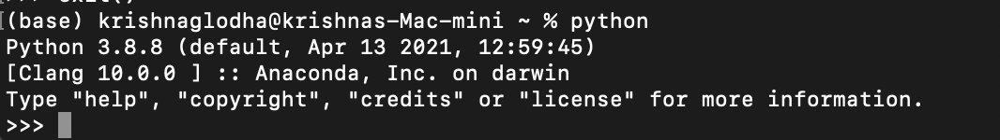
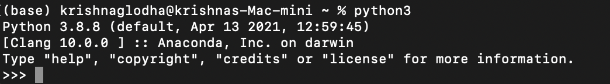
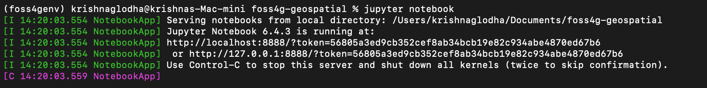
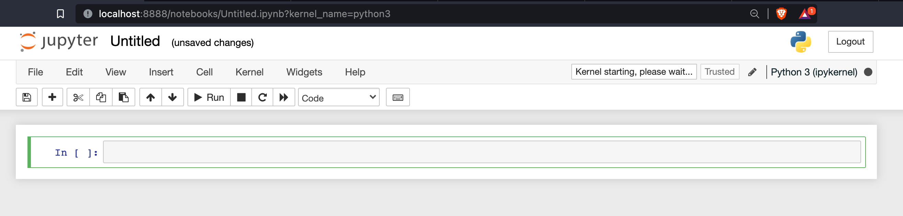
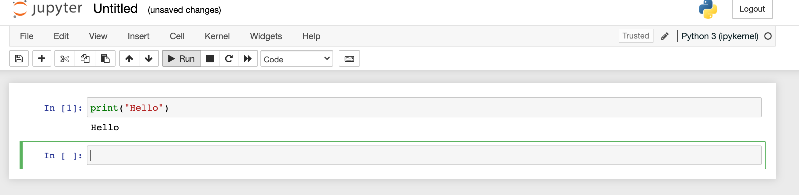

## 📢 Geospatial analysis with python 101 

Krishna Lodha (https://krishnaglodha.com/)

### 👤 Who should tune in for this workshop
- Python enthusiast
- GIS Analysts
- GIS Developers 


### 📖 What will you learn
- Basics of Python
- Pandas, Numpy, MatplotLib
- Vector Analysis with Python 
- Raster Analysis with Python
- Vector data visualization
- Interactive Mapping in Python

### 📦 Prerequisite 
- Basic GIS knowledge

### 🤝 Connect with me 
- LinkedIn - https://www.linkedin.com/in/krishnaglodha/
- YouTube - Krishna Lodha (12000 + subs)
- email - me@krishnaglodha.com


---------------------------------------------------------------------------------------------------------------------

## ⚒️ Pack Gears


#### 1. Install Python to your machine

Check if python is installed, 

open <b>terminal/commad-prompt</b> and type `python` if you see anything like



type `python3` if you see anything like



If you got error bit times, go to python official site and click on download https://www.python.org/downloads/

this will dowload executable file (windows/mac) 


#### 2. Understand the logic of python development

- Packages 
- Environment


#### 3. Install Environment (Conda)
Head over to Anaconda official download page https://www.anaconda.com/products/individua and install it. 

Once, installation is done, if you are on mac/linux, you will see `(base)` written in your terminal , if you are on windows, go to search bar and look for conda terminal

Read more about conda environment creation, sharing, etc. at https://docs.conda.io/projects/conda/en/latest/user-guide/tasks/manage-environments.html


#### 4. Create environment
For this workshop, we'll create an environment with name `foss4env` and then we'll install whatever package we need inside this

First pakcage we'll be working with is `notebook` . Jupyter notebooks are interactive way for us to write python code in the browser directly.
<b> Creatig env </b> 
Open Conda command prompt for windows or normal terminal  on mac/linux, and create environment using following command

`conda create -n foss4env Python==3.6` , once created , activate the environment using `conda activate foss4env` by doing this you can see the `(base)` will change to `(foss4env)`

#### 5. Installing package

Now we can install package `pip install notebook`, everytime we want to install any package, we'll be running similar command

#### 6. Running jupyter notebook

After package in installed, simply start the notebook by typing `jupyter notebook`




#### 7. Creating notebook

head over to http://localhost:8888/tree where you can then click on <b>new </b> to ceate new Python3 notebook

Here you can start writing code in python, in the first line write

```
    print('Hello')
```
and hit Run Key to see following result




---------------------------------------------------------------------------------------------------------------------

## 🚀 Get Stared


