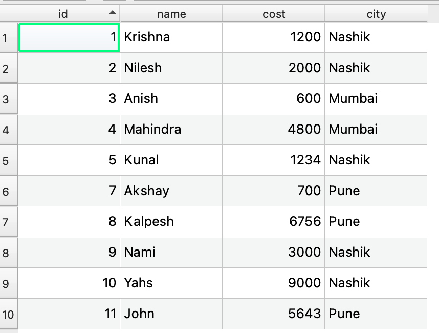
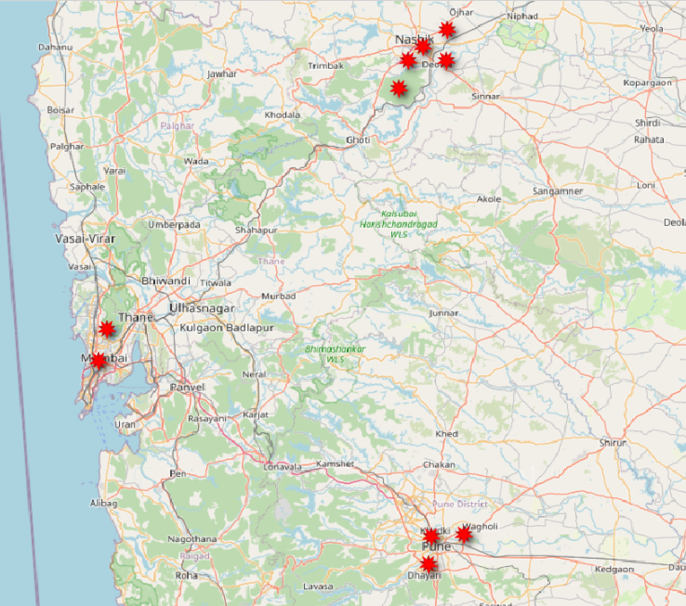
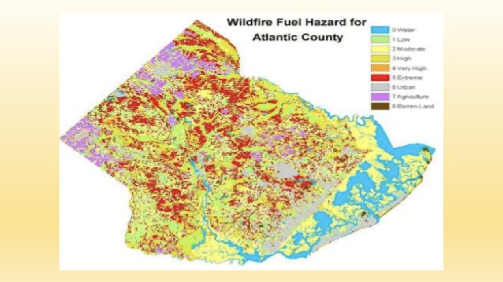

# Introduction to GIS for Software developers

Property: Apr 11, 2021 11:24 AM
Tags: development, javascript, python

If you decide to work on a niche field in web development, GIS (Geographic information system) is one of the best route you can opt in. As more and more businesses are now-a-days relying on location data of either their customers or products, it's crucial for them to have a resource who can understand how to build things online as well as how to leverage these location insights. 

GIS web developers are exactly those people. They work with modern technologies that usual developers work with, along with specific frameworks designs for GIS requirements. We'll have a look at what are the routes available for a GIS web developer later in the blog


## ⚫ What the 🐟 is GIS ?

wiki says, A geographic information system (GIS) is a conceptualised framework that provides the ability to capture and analyse spatial and geographic data.

A simpler explanation can be, GIS deals with location data(latitude, longitude) or information captured from satellite by emitting and capturing various radiations. 

Any data, which once coupled with location information, can be treated with GIS. This information is usually collection of location coordinates.

```json
{
      "type": "Feature",
      "geometry": {
        "type": "Point",
        "coordinates": [
          9082754.208125336,
          2281653.6686085174
        ]
      },
      "properties": {
        "shape": "Point",
				"id" :  12,
				"name" : "point of contact",
				"price" : 3400
	      }
}
```

above snippet represents location of one point which has several properties such as *shape, id, name, price* along with the location coordinates. Using these coordinates, we can place this point on the face of the earth

## ⚫ A simple use case for GIS?

### ➡️ Silly example:

Imagine you working on  orders data collected by an e-commerce website. This will typically include customer's id, address, products list, etc. when you'll have such 10k orders, you can draw out some patterns such as what product is sold most, what total revenue you have generated, etc. but If you want to draw conclusion based on which city did most of the orders, you'll have to collect that information too.

If you want to see which specific area or zip code is ordering most, then you'll have to put all the customer's address on a map. By doing this you'll be able to see all data in a visualisation which will immediately provide insights. 

Here is the example for this





The table helps us to see the numbers, texts, etc. but as soon as we put the data on map, we can immediately observe data. 

Although this might be very silly example, many multi Billion dollar companies uses location data as a primary logic for their business. Good example of this can be Uber. 

### ➡️ Uber's usage of location data

As soon as you request for taxi, based on your location and your destination location, uber's algorithm spits out a driver who is close to you, has vehicle in the category you are okay with and can accept the ride. 

A little secret 🤫, uber's price surge also uses location data. Basically uber divides the entire world into smaller spatial hexagons. This hexagons are coloured in realtime based on how many user's are requesting ride in certain hexagon, and how many drivers are available. Imagine if you are outside stadium along with 50000 other people after a football match, If 2000 people along with you are requesting uber, the hexagon in which you are, will turn red, letting uber know that the demand here is more, thus automatically surge charge will be added. 

You can check more about this logic and technology behind it [here](https://eng.uber.com/h3/) .

### ➡️ Keeping eye on forests

Remote sensing and more recently drone technologies has helped government a lot to keep an eye on thousands of hectors of land from a single office. Remote sensing concepts and technologies helps engineers to use the latest imageries acquired by various satellites to keep checking the huge land areas. It plays crucial role to keep checking whether if there are any illegal activities such as constructions, deforestation, etc. going on. 



With the advancement in remote sensing, people have started using it in fields such as construction industry, precision farming, insurance ,military surveillance,Land use, land covers, etc.  

## ⚫ What is the Development scene in GIS ?

GIS, specifically from software developer's angle can be divided into 2 main categories. 

### ➡️ Open source development

As the name suggest, Open source development includes usage of technologies, framework, data which is available free of cost to use in any commercial, non-commercial projects. This usually consists of projects developed by community over the years. It is easy for a new developers to take this path, as all available technologies are free to learn and implement, developers and companies saves lot of license fees. 

Pros for Open source development: 

1. Since it's free to use in commercial projects as well, companies and developers both saves license costs
2. More companies are turning towards Open source development as technology is advancing.
3. Contributing to Open source tech makes developers profile stronger. 

### ➡️ Enterprise development

This usually includes development stack which is paid either as one time, or subscription basis or usage basis. This includes big player such as Google Maps, Here Maps, etc. Although each of these tech has a free tier, they certainly need license key to work. These products are usually much more tested internally by company thus are more stable as compared to Open source products. Usually large companies rely on using enterprise products as these products are more secure, tested and customer support is available.

Pros for Enterprise development: 

1. Cleaner and clearer documentation
2. Dedicated support and help service 
3. Stable and safer to use , as the data security is handled by companies.

Both categories have their own pros and cons, thus stating one is better than other won't be correct. Although knowing about both options is a wise thing, since then depending upon client's requirement, budget, use case, you can suggest the tech. stack. 

I'll be stating some of the products available in both of these categories as we move ahead.

## ⚫ Options for Software developers in GIS

You can position your self at several roles just like how we do in software industry. I'll discuss some of the very common roles vaguely below:

### ➡️ Front end GIS developer

This role deals with displaying and processing the GIS data on client side. Imagine an application's API is collecting the latitude and longitude of the customer. But what next? how do we display/visualise those in order to make sense out of it? That is where Front end developer jumps in. This includes showing various data (Point, Lines, Polygons, Imageries ) on the softwares along with allowing user to interact with such data. Example of interactions can be drawing geometry, selecting geometry, changing the geometry projections, etc. 

**Open source Technologies:** 

1. Openlayers 
2. Leaflet.js

**Enterprise Technologies :** 

1. ArcGIS JS 
2. Mapbox GL JS
3. Google Maps JS API

Although all these enterprise JS technologies can be used freely, they need license key.

### ➡️ Back end GIS developer

This roles deals with treating geospatial data server side. This includes saving incoming data from client or any devices to the database with creating proper geometry. If we save latitude and longitude just as numbers, database will not be able to run spatial queries on it. hence we need to save this data as a *geometry* in database.

Another major task for this role is to create ***spatial functions.*** Generally we query the data based on attributes types of text, numbers, date, etc. such as

- Name Like 'Ross'
- Profession = 'dino'
- age > 40

spatial functions, deals with creating queries based on location such as

- Finding coffee shops within 5 miles radius of given latitude, longitude
- Get all states polygons which contains a river geometry, etc.

This role includes either creating such functions as an API or writing queries directly on database. 

**Open source Technologies:** 

1. Geodjango 
2. Geospatial libraries built on Python (Geopandas, shapely, fiona, etc.)
3. Turf.js

**Enterprise Technologies :** 

1. ESRI
2. Google Maps API

There are tons of other jobs that web GIS developer works on, such as 

- Creating and maintaining spatial databases
- Creating routing algorithms
- Creating search engines using geospatial data
- Dealing with satellite imagery data
- Developing Mobile applications to track realtime locations, etc.

## ⚫ How do I start?

Assuming that you are interested in getting to this niche field, I can help you with getting started into this career option. 

### Step 1 : Subscribe to get updates on upcoming stuff

I love to write, record, share the content based on GIS. I have several blogs, videos with lot of good responses. Subscribing to the newsletter will be one additional email every month including my blogs, videos, articles I read, latest news, jobs available in GIS domain, etc.

[https://chilipepper.io/form/xhot-darkyellow-ghosts-8d15ee41-7159-48f8-879a-6e12e3a656b3](https://chilipepper.io/form/xhot-darkyellow-ghosts-8d15ee41-7159-48f8-879a-6e12e3a656b3)

### Step 2 : Checkout my course on GIS web development on Udemy

[My course](https://www.udemy.com/course/complete-web-gis-development-course/?referralCode=CFB3B9B28534B47EC650)  is one of the top courses in GIS and web development category on Udemy. If you click on the 👉🏻 [this](https://www.udemy.com/course/complete-web-gis-development-course/?referralCode=CFB3B9B28534B47EC650) 👈🏻 link, you can avail the best discount available at the current moment.

[Web GIS development course in 2020](https://www.udemy.com/course/complete-web-gis-development-course/?referralCode=CFB3B9B28534B47EC650)

---

Checkout blog :  [Concepts of GIS](https://www.notion.so/Basic-concepts-of-GIS-699575640d6847bc95b224f58941b911) 

### Take me back to

[ Blogs](https://www.notion.so/3a74f987843b495197cf4f5398158c74)

[Krishna G Lodha](https://www.notion.so/Krishna-G-Lodha-dd0fbaa3b1204d86992304bf33f441c4)